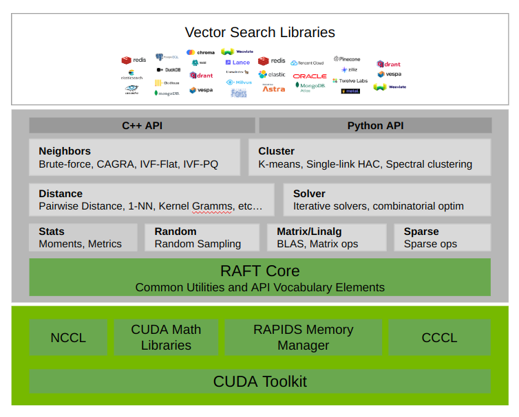

# <div align="left">&nbsp;RAFT: GPU-Accelerated Vector Similarity Search</div>



## Resources

- [RAFT Documentation](https://docs.rapids.ai/api/raft/stable/): Official Documentation.
- [RAFT Getting Started](./docs/source/quick_start.md): Getting started with RAFT.
- [Build and Install RAFT](./docs/source/build.md): Instructions for installing and building RAFT.
- [RAPIDS Community](https://rapids.ai/community.html): Get help, contribute, and collaborate.
- [GitHub repository](https://github.com/rapidsai/raft): Download the RAFT source code.
- [Issue tracker](https://github.com/rapidsai/raft/issues): Report issues or request features.

## Overview

In addition to being critical components for vector databases, vector similarity search unlocks several other applications that span information retrieval, data mining, and machine learning. RAFT contains algorithms and reusable building blocks for accelerating vector similarity search on the GPU. RAFT will continue to be optimized as new GPU architectures are released to make sure you are always getting the best performance from your hardware.

### Vector Similarity Search

RAFT contains state-of-the-art implementations of approximate nearest neighbors algorithms on the GPU that enable vector similarity search. Vector similarity search applications often require fast online queries done one-at-a-time and RAFT's graph-based CAGRA algorithm outperforms the state-of-the art on the CPU (hierarchical navigable small-world graph or HNSW).

In addition to CAGRA, RAFT contains other state-of-the-art GPU-accelerated implementations of popular algorithms for vector similarity search, such as IVF-Flat and IVF-PQ algorithms originally popularized by the FAISS library. 

### Information Retrieval

RAFT also contains a catalog of reusable primitives for composing algorithms that require fast neighborhood computations, such as
1. Computing distances between vectors and computing kernel gramm matrices
2. Performing ball radius queries for constructing epsilon neighborhoods
3. Clustering points to partition a space for smaller faster searches
4. Constructing neighborhood "connectivities" graphs from dense vectors

As an example, computations such as the above list are critical for information retrieval, data mining, and machine learning applications such as clustering, manifold learning, and dimensionality reduction.

## What is RAFT?

At its core, RAFT is a C++ header-only template library with an optional shared library that 
1) can speed up compile times for common template types, and 
2) provides host-accessible "runtime" APIs, which don't require a CUDA compiler to use

RAFT also provides a Python library called `pylibraft`, which contains lightweight wrappers around the C++ library.


Please read the [Getting Started](./docs/source/quick_start.md) to quickly get up and running with RAFT. This guide contains code examples for RAFT's C++ and Python APIs.


[//]: # (## Getting started)

[//]: # ()
[//]: # (### RAPIDS Memory Manager &#40;RMM&#41;)

[//]: # ()
[//]: # (RAFT relies heavily on RMM which eases the burden of configuring different allocation strategies globally across the libraries that use it.)

[//]: # ()
[//]: # (### Multi-dimensional Arrays)

[//]: # ()
[//]: # (The APIs in RAFT accept the [mdspan]&#40;https://arxiv.org/abs/2010.06474&#41; multi-dimensional array view for representing data in higher dimensions similar to the `ndarray` in the Numpy Python library. RAFT also contains the corresponding owning `mdarray` structure, which simplifies the allocation and management of multi-dimensional data in both host and device &#40;GPU&#41; memory.)

[//]: # ()
[//]: # (The `mdarray` forms a convenience layer over RMM and can be constructed in RAFT using a number of different helper functions:)

[//]: # ()
[//]: # (```c++)

[//]: # (#include <raft/core/device_mdarray.hpp>)

[//]: # ()
[//]: # (int n_rows = 10;)

[//]: # (int n_cols = 10;)

[//]: # ()
[//]: # (auto scalar = raft::make_device_scalar<float>&#40;handle, 1.0&#41;;)

[//]: # (auto vector = raft::make_device_vector<float>&#40;handle, n_cols&#41;;)

[//]: # (auto matrix = raft::make_device_matrix<float>&#40;handle, n_rows, n_cols&#41;;)

[//]: # (```)

[//]: # ()
[//]: # (### C++ Example)

[//]: # ()
[//]: # (Most of the primitives in RAFT accept a `raft::device_resources` object for the management of resources which are expensive to create, such CUDA streams, stream pools, and handles to other CUDA libraries like `cublas` and `cusolver`.)

[//]: # ()
[//]: # (The example below demonstrates creating a RAFT handle and using it with `device_matrix` and `device_vector` to allocate memory, generating random clusters, and computing)

[//]: # (pairwise Euclidean distances:)

[//]: # (```c++)

[//]: # (#include <raft/core/device_resources.hpp>)

[//]: # (#include <raft/core/device_mdarray.hpp>)

[//]: # (#include <raft/random/make_blobs.cuh>)

[//]: # (#include <raft/distance/distance.cuh>)

[//]: # ()
[//]: # (raft::device_resources handle;)

[//]: # ()
[//]: # (int n_samples = 5000;)

[//]: # (int n_features = 50;)

[//]: # ()
[//]: # (auto input = raft::make_device_matrix<float, int>&#40;handle, n_samples, n_features&#41;;)

[//]: # (auto labels = raft::make_device_vector<int, int>&#40;handle, n_samples&#41;;)

[//]: # (auto output = raft::make_device_matrix<float, int>&#40;handle, n_samples, n_samples&#41;;)

[//]: # ()
[//]: # (raft::random::make_blobs&#40;handle, input.view&#40;&#41;, labels.view&#40;&#41;&#41;;)

[//]: # ()
[//]: # (auto metric = raft::distance::DistanceType::L2SqrtExpanded;)

[//]: # (raft::distance::pairwise_distance&#40;handle, input.view&#40;&#41;, input.view&#40;&#41;, output.view&#40;&#41;, metric&#41;;)

[//]: # (```)

[//]: # ()
[//]: # (It's also possible to create `raft::device_mdspan` views to invoke the same API with raw pointers and shape information:)

[//]: # ()
[//]: # (```c++)

[//]: # (#include <raft/core/device_resources.hpp>)

[//]: # (#include <raft/core/device_mdspan.hpp>)

[//]: # (#include <raft/random/make_blobs.cuh>)

[//]: # (#include <raft/distance/distance.cuh>)

[//]: # ()
[//]: # (raft::device_resources handle;)

[//]: # ()
[//]: # (int n_samples = 5000;)

[//]: # (int n_features = 50;)

[//]: # ()
[//]: # (float *input;)

[//]: # (int *labels;)

[//]: # (float *output;)

[//]: # ()
[//]: # (...)

[//]: # (// Allocate input, labels, and output pointers)

[//]: # (...)

[//]: # ()
[//]: # (auto input_view = raft::make_device_matrix_view&#40;input, n_samples, n_features&#41;;)

[//]: # (auto labels_view = raft::make_device_vector_view&#40;labels, n_samples&#41;;)

[//]: # (auto output_view = raft::make_device_matrix_view&#40;output, n_samples, n_samples&#41;;)

[//]: # ()
[//]: # (raft::random::make_blobs&#40;handle, input_view, labels_view&#41;;)

[//]: # ()
[//]: # (auto metric = raft::distance::DistanceType::L2SqrtExpanded;)

[//]: # (raft::distance::pairwise_distance&#40;handle, input_view, input_view, output_view, metric&#41;;)

[//]: # (```)

[//]: # ()
[//]: # ()
[//]: # (### Python Example)

[//]: # ()
[//]: # (The `pylibraft` package contains a Python API for RAFT algorithms and primitives. `pylibraft` integrates nicely into other libraries by being very lightweight with minimal dependencies and accepting any object that supports the `__cuda_array_interface__`, such as [CuPy's ndarray]&#40;https://docs.cupy.dev/en/stable/user_guide/interoperability.html#rmm&#41;. The number of RAFT algorithms exposed in this package is continuing to grow from release to release.)

[//]: # ()
[//]: # (The example below demonstrates computing the pairwise Euclidean distances between CuPy arrays. Note that CuPy is not a required dependency for `pylibraft`.)

[//]: # ()
[//]: # (```python)

[//]: # (import cupy as cp)

[//]: # ()
[//]: # (from pylibraft.distance import pairwise_distance)

[//]: # ()
[//]: # (n_samples = 5000)

[//]: # (n_features = 50)

[//]: # ()
[//]: # (in1 = cp.random.random_sample&#40;&#40;n_samples, n_features&#41;, dtype=cp.float32&#41;)

[//]: # (in2 = cp.random.random_sample&#40;&#40;n_samples, n_features&#41;, dtype=cp.float32&#41;)

[//]: # ()
[//]: # (output = pairwise_distance&#40;in1, in2, metric="euclidean"&#41;)

[//]: # (```)

[//]: # ()
[//]: # (The `output` array in the above example is of type `raft.common.device_ndarray`, which supports [__cuda_array_interface__]&#40;https://numba.pydata.org/numba-doc/dev/cuda/cuda_array_interface.html#cuda-array-interface-version-2&#41; making it interoperable with other libraries like CuPy, Numba, PyTorch and RAPIDS cuDF that also support it. CuPy supports DLPack, which also enables zero-copy conversion from `raft.common.device_ndarray` to JAX and Tensorflow.)

[//]: # ()
[//]: # (Below is an example of converting the output `pylibraft.device_ndarray` to a CuPy array:)

[//]: # (```python)

[//]: # (cupy_array = cp.asarray&#40;output&#41;)

[//]: # (```)

[//]: # ()
[//]: # (And converting to a PyTorch tensor:)

[//]: # (```python)

[//]: # (import torch)

[//]: # ()
[//]: # (torch_tensor = torch.as_tensor&#40;output, device='cuda'&#41;)

[//]: # (```)

[//]: # ()
[//]: # (Or converting to a RAPIDS cuDF dataframe:)

[//]: # (```python)

[//]: # (cudf_dataframe = cudf.DataFrame&#40;output&#41;)

[//]: # (```)

[//]: # ()
[//]: # (When the corresponding library has been installed and available in your environment, this conversion can also be done automatically by all RAFT compute APIs by setting a global configuration option:)

[//]: # (```python)

[//]: # (import pylibraft.config)

[//]: # (pylibraft.config.set_output_as&#40;"cupy"&#41;  # All compute APIs will return cupy arrays)

[//]: # (pylibraft.config.set_output_as&#40;"torch"&#41; # All compute APIs will return torch tensors)

[//]: # (```)

[//]: # ()
[//]: # (You can also specify a `callable` that accepts a `pylibraft.common.device_ndarray` and performs a custom conversion. The following example converts all output to `numpy` arrays:)

[//]: # (```python)

[//]: # (pylibraft.config.set_output_as&#40;lambda device_ndarray: return device_ndarray.copy_to_host&#40;&#41;&#41;)

[//]: # (```)

[//]: # ()
[//]: # (`pylibraft` also supports writing to a pre-allocated output array so any `__cuda_array_interface__` supported array can be written to in-place:)

[//]: # ()
[//]: # (```python)

[//]: # (import cupy as cp)

[//]: # ()
[//]: # (from pylibraft.distance import pairwise_distance)

[//]: # ()
[//]: # (n_samples = 5000)

[//]: # (n_features = 50)

[//]: # ()
[//]: # (in1 = cp.random.random_sample&#40;&#40;n_samples, n_features&#41;, dtype=cp.float32&#41;)

[//]: # (in2 = cp.random.random_sample&#40;&#40;n_samples, n_features&#41;, dtype=cp.float32&#41;)

[//]: # (output = cp.empty&#40;&#40;n_samples, n_samples&#41;, dtype=cp.float32&#41;)

[//]: # ()
[//]: # (pairwise_distance&#40;in1, in2, out=output, metric="euclidean"&#41;)

[//]: # (```)


## Installing

RAFT itself can be installed through conda, [CMake Package Manager (CPM)](https://github.com/cpm-cmake/CPM.cmake), pip, or by building the repository from source. Please refer to the [build instructions](docs/source/build.md) for more a comprehensive guide on installing and building RAFT and using it in downstream projects.

### Conda

The easiest way to install RAFT is through conda and several packages are provided.
- `libraft-headers` RAFT headers
- `libraft` (optional) shared library of pre-compiled template instantiations and runtime APIs.
- `pylibraft` (optional) Python wrappers around RAFT algorithms and primitives.
- `raft-dask` (optional) enables deployment of multi-node multi-GPU algorithms that use RAFT `raft::comms` in Dask clusters.

Use the following command to install all of the RAFT packages with conda (replace `rapidsai` with `rapidsai-nightly` to install more up-to-date but less stable nightly packages). `mamba` is preferred over the `conda` command.
```bash
mamba install -c rapidsai -c conda-forge -c nvidia raft-dask pylibraft
```

You can also install the conda packages individually using the `mamba` command above.

After installing RAFT, `find_package(raft COMPONENTS compiled distributed)` can be used in your CUDA/C++ cmake build to compile and/or link against needed dependencies in your raft target. `COMPONENTS` are optional and will depend on the packages installed.

### Pip

pylibraft and raft-dask both have experimental packages that can be [installed through pip](https://rapids.ai/pip.html#install):
```bash
pip install pylibraft-cu11 --extra-index-url=https://pypi.nvidia.com
pip install raft-dask-cu11 --extra-index-url=https://pypi.nvidia.com
```

### CMake & CPM

RAFT uses the [RAPIDS-CMake](https://github.com/rapidsai/rapids-cmake) library, which makes it easy to include in downstream cmake projects. RAPIDS-CMake provides a convenience layer around CPM. Please refer to [these instructions](https://github.com/rapidsai/rapids-cmake#installation) to install and use rapids-cmake in your project.

#### Example Template Project

You can find an [example RAFT](cpp/template/README.md) project template in the `cpp/template` directory, which demonstrates how to build a new application with RAFT or incorporate RAFT into an existing cmake project.

#### CMake Targets

Additional CMake targets can be made available by adding components in the table below to the `RAFT_COMPONENTS` list above, separated by spaces. The `raft::raft` target will always be available. RAFT headers require, at a minimum, the CUDA toolkit libraries and RMM dependencies.

| Component   | Target              | Description                                              | Base Dependencies                      |
|-------------|---------------------|----------------------------------------------------------|----------------------------------------|
| n/a         | `raft::raft`        | Full RAFT header library                                 | CUDA toolkit, RMM, NVTX, CCCL, CUTLASS |
| compiled    | `raft::compiled`    | Pre-compiled template instantiations and runtime library | raft::raft                             |
| distributed | `raft::distributed` | Dependencies for `raft::comms` APIs                      | raft::raft, UCX, NCCL                  |

### Source

The easiest way to build RAFT from source is to use the `build.sh` script at the root of the repository:
1. Create an environment with the needed dependencies:
```
mamba env create --name raft_dev_env -f conda/environments/all_cuda-118_arch-x86_64.yaml
mamba activate raft_dev_env
```
```
./build.sh raft-dask pylibraft libraft tests bench --compile-lib
```

The [build](docs/source/build.md) instructions contain more details on building RAFT from source and including it in downstream projects. You can also find a more comprehensive version of the above CPM code snippet the [Building RAFT C++ from source](docs/source/build.md#building-raft-c-from-source-in-cmake) section of the build instructions.

## Reusable Primitives

While not exhaustive, the following general categories help summarize the accelerated building blocks that RAFT contains:
####
| Category | Examples |
| --- | --- |
| **Data Formats** | sparse & dense, conversions, data generation |
| **Dense Operations** | linear algebra, matrix and vector operations, reductions, slicing, norms, factorization, least squares, svd & eigenvalue problems |
| **Sparse Operations** | linear algebra, eigenvalue problems, slicing, norms, reductions, factorization, symmetrization, components & labeling |
| **Spatial** | pairwise distances, nearest neighbors, neighborhood graph construction |
| **Basic Clustering** | spectral clustering, hierarchical clustering, k-means |
| **Solvers** | combinatorial optimization, iterative solvers |
| **Statistics** | sampling, moments and summary statistics, metrics |
| **Tools & Utilities** | common utilities for developing CUDA applications, multi-node multi-gpu infrastructure |


## Folder Structure and Contents

The folder structure mirrors other RAPIDS repos, with the following folders:

- `ci`: Scripts for running CI in PRs
- `conda`: Conda recipes and development conda environments
- `cpp`: Source code for C++ libraries.
  - `bench`: Benchmarks source code
  - `cmake`: CMake modules and templates
  - `doxygen`: Doxygen configuration
  - `include`: The C++ API headers are fully-contained here (deprecated directories are excluded from the listing below)
    - `cluster`: Basic clustering primitives and algorithms.
    - `comms`: A multi-node multi-GPU communications abstraction layer for NCCL+UCX and MPI+NCCL, which can be deployed in Dask clusters using the `raft-dask` Python package.
    - `core`: Core API headers which require minimal dependencies aside from RMM and Cudatoolkit. These are safe to expose on public APIs and do not require `nvcc` to build. This is the same for any headers in RAFT which have the suffix `*_types.hpp`.
    - `distance`: Distance primitives
    - `linalg`: Dense linear algebra
    - `matrix`: Dense matrix operations
    - `neighbors`: Nearest neighbors and knn graph construction
    - `random`: Random number generation, sampling, and data generation primitives
    - `solver`: Iterative and combinatorial solvers for optimization and approximation
    - `sparse`: Sparse matrix operations
      - `convert`: Sparse conversion functions
      - `distance`: Sparse distance computations
      - `linalg`: Sparse linear algebra
      - `neighbors`: Sparse nearest neighbors and knn graph construction
      - `op`: Various sparse operations such as slicing and filtering (Note: this will soon be renamed to `sparse/matrix`)
      - `solver`: Sparse solvers for optimization and approximation
    - `stats`: Moments, summary statistics, model performance measures
    - `util`: Various reusable tools and utilities for accelerated algorithm development
  - `internal`: A private header-only component that hosts the code shared between benchmarks and tests.
  - `scripts`: Helpful scripts for development
  - `src`: Compiled APIs and template instantiations for the shared libraries
  - `template`: A skeleton template containing the bare-bones file structure and cmake configuration for writing applications with RAFT.
  - `test`: Googletests source code
- `docs`: Source code and scripts for building library documentation (Uses breath, doxygen, & pydocs)
- `python`: Source code for Python libraries.
  - `pylibraft`: Python build and source code for pylibraft library
  - `raft-dask`: Python build and source code for raft-dask library
- `thirdparty`: Third-party licenses

## Contributing

If you are interested in contributing to the RAFT project, please read our [Contributing guidelines](docs/source/contributing.md). Refer to the [Developer Guide](docs/source/developer_guide.md) for details on the developer guidelines, workflows, and principals.

## References

When citing RAFT generally, please consider referencing this Github project.
```bibtex
@misc{rapidsai,
  title={Rapidsai/raft: RAFT contains fundamental widely-used algorithms and primitives for data science, Graph and machine learning.},
  url={https://github.com/rapidsai/raft},
  journal={GitHub},
  publisher={Nvidia RAPIDS},
  author={Rapidsai},
  year={2022}
}
```
If citing the sparse pairwise distances API, please consider using the following bibtex:
```bibtex
@article{nolet2021semiring,
  title={Semiring primitives for sparse neighborhood methods on the gpu},
  author={Nolet, Corey J and Gala, Divye and Raff, Edward and Eaton, Joe and Rees, Brad and Zedlewski, John and Oates, Tim},
  journal={arXiv preprint arXiv:2104.06357},
  year={2021}
}
```
