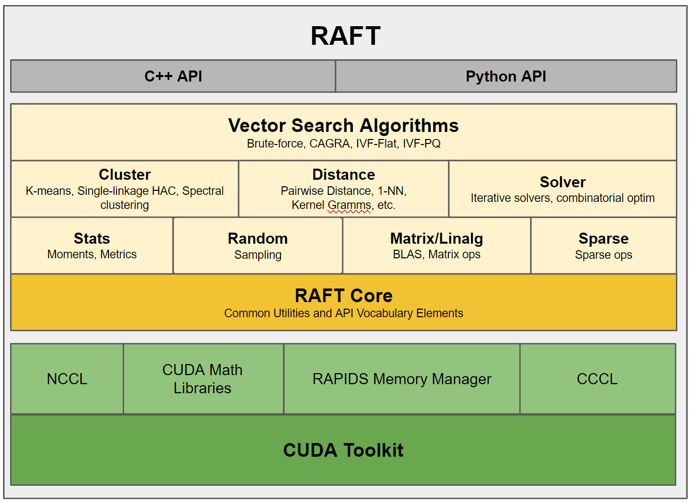
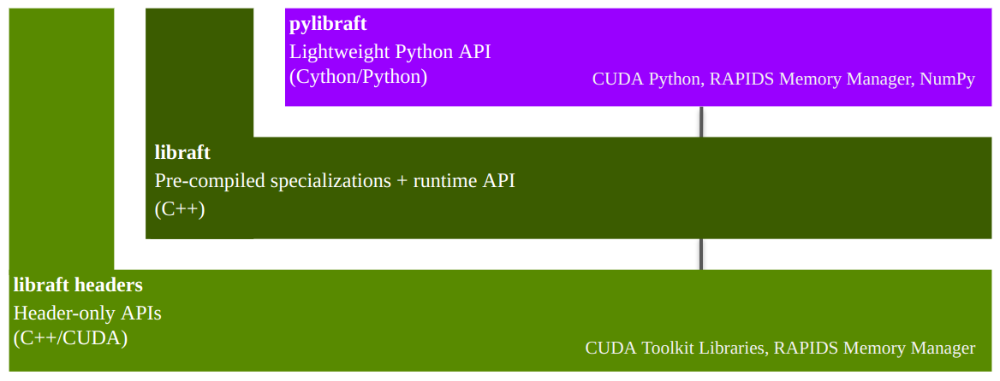

# <div align="left">&nbsp;RAFT: Reusable Accelerated Functions and Tools for Vector Search and More</div>

> [!IMPORTANT]
> The vector search and clustering algorithms in RAFT have been formally migrated to a new library dedicated to vector search called [cuVS](https://github.com/rapidsai/cuvs). The headers for the vector search and clustering algorithms in RAFT will remain for a bried period, but will no longer be tested, benchmarked, included in the pre-compiled libraft binary, or otherwise updated after the 24.12 (December 2024) release. We will be removing these headers altogether in a future release. It is strongly suggested to use cuVS for these routines, which include any headers in the `distance`, `neighbors`, `cluster` and `spatial` directories, and use the RAFT versions at your own risk.




## Contents
<hr>

1. [Useful Resources](#useful-resources)
2. [What is RAFT?](#what-is-raft)
2. [Use cases](#use-cases)
3. [Is RAFT right for me?](#is-raft-right-for-me)
4. [Getting Started](#getting-started)
5. [Installing RAFT](#installing)
6. [Codebase structure and contents](#folder-structure-and-contents)
7. [Contributing](#contributing)
8. [References](#references)

<hr>

## Useful Resources

- [RAFT Reference Documentation](https://docs.rapids.ai/api/raft/stable/): API Documentation.
- [RAFT Getting Started](./docs/source/quick_start.md): Getting started with RAFT.
- [Build and Install RAFT](./docs/source/build.md): Instructions for installing and building RAFT.
- [RAPIDS Community](https://rapids.ai/community.html): Get help, contribute, and collaborate.
- [GitHub repository](https://github.com/rapidsai/raft): Download the RAFT source code.
- [Issue tracker](https://github.com/rapidsai/raft/issues): Report issues or request features.


## What is RAFT?

RAFT contains fundamental widely-used algorithms and primitives for machine learning and data mining. The algorithms are CUDA-accelerated and form building blocks for more easily writing high performance applications.

By taking a primitives-based approach to algorithm development, RAFT
- accelerates algorithm construction time
- reduces the maintenance burden by maximizing reuse across projects, and
- centralizes core reusable computations, allowing future optimizations to benefit all algorithms that use them.

While not exhaustive, the following general categories help summarize the accelerated functions in RAFT:
#####
| Category              | Accelerated Functions in RAFT                                                                                                     |
|-----------------------|-----------------------------------------------------------------------------------------------------------------------------------|
| **Data Formats**      | sparse & dense, conversions, data generation                                                                                      |
| **Dense Operations**  | linear algebra, matrix and vector operations, reductions, slicing, norms, factorization, least squares, svd & eigenvalue problems |
| **Sparse Operations** | linear algebra, eigenvalue problems, slicing, norms, reductions, factorization, symmetrization, components & labeling             |
| **Solvers**           | combinatorial optimization, iterative solvers                                                                                     |
| **Statistics**        | sampling, moments and summary statistics, metrics, model evaluation                                                               |
| **Tools & Utilities** | common tools and utilities for developing CUDA applications, multi-node multi-gpu infrastructure                                  |


RAFT is a C++ header-only template library with an optional shared library that
1) can speed up compile times for common template types, and
2) provides host-accessible "runtime" APIs, which don't require a CUDA compiler to use

In addition being a C++ library, RAFT also provides 2 Python libraries:
- `pylibraft` - lightweight Python wrappers around RAFT's host-accessible "runtime" APIs.
- `raft-dask` - multi-node multi-GPU communicator infrastructure for building distributed algorithms on the GPU with Dask.




## Is RAFT right for me?

RAFT contains low-level primitives for accelerating applications and workflows. Data source providers and application developers may find specific tools -- like ANN algorithms -- very useful. RAFT is not intended to be used directly by data scientists for discovery and experimentation. For data science tools, please see the [RAPIDS website](https://rapids.ai/).

## Getting started

### RAPIDS Memory Manager (RMM)

RAFT relies heavily on RMM which eases the burden of configuring different allocation strategies globally across the libraries that use it.

### Multi-dimensional Arrays

The APIs in RAFT accept the [mdspan](https://arxiv.org/abs/2010.06474) multi-dimensional array view for representing data in higher dimensions similar to the `ndarray` in the Numpy Python library. RAFT also contains the corresponding owning `mdarray` structure, which simplifies the allocation and management of multi-dimensional data in both host and device (GPU) memory.

The `mdarray` forms a convenience layer over RMM and can be constructed in RAFT using a number of different helper functions:

```c++
#include <raft/core/device_mdarray.hpp>

int n_rows = 10;
int n_cols = 10;

auto scalar = raft::make_device_scalar<float>(handle, 1.0);
auto vector = raft::make_device_vector<float>(handle, n_cols);
auto matrix = raft::make_device_matrix<float>(handle, n_rows, n_cols);
```

### C++ Example

Most of the primitives in RAFT accept a `raft::device_resources` object for the management of resources which are expensive to create, such CUDA streams, stream pools, and handles to other CUDA libraries like `cublas` and `cusolver`.

The example below demonstrates creating a RAFT handle and using it with `device_matrix` and `device_vector` to allocate memory, generating random clusters, and computing
pairwise Euclidean distances:
```c++
#include <raft/core/device_resources.hpp>
#include <raft/core/device_mdarray.hpp>
#include <raft/random/make_blobs.cuh>
#include <raft/distance/distance.cuh>

raft::device_resources handle;

int n_samples = 5000;
int n_features = 50;

auto input = raft::make_device_matrix<float, int>(handle, n_samples, n_features);
auto labels = raft::make_device_vector<int, int>(handle, n_samples);
auto output = raft::make_device_matrix<float, int>(handle, n_samples, n_samples);

raft::random::make_blobs(handle, input.view(), labels.view());

auto metric = raft::distance::DistanceType::L2SqrtExpanded;
raft::distance::pairwise_distance(handle, input.view(), input.view(), output.view(), metric);
```

It's also possible to create `raft::device_mdspan` views to invoke the same API with raw pointers and shape information. Take this example from the [NVIDIA cuVS](https://github.com/rapidsai/cuvs) library:

```c++
#include <raft/core/device_resources.hpp>
#include <raft/core/device_mdspan.hpp>
#include <raft/random/make_blobs.cuh>
#include <cuvs/distance/distance.hpp>

raft::device_resources handle;

int n_samples = 5000;
int n_features = 50;

float *input;
int *labels;
float *output;

...
// Allocate input, labels, and output pointers
...

auto input_view = raft::make_device_matrix_view(input, n_samples, n_features);
auto labels_view = raft::make_device_vector_view(labels, n_samples);
auto output_view = raft::make_device_matrix_view(output, n_samples, n_samples);

raft::random::make_blobs(handle, input_view, labels_view);

auto metric = cuvs::distance::DistanceType::L2SqrtExpanded;
cuvs::distance::pairwise_distance(handle, input_view, input_view, output_view, metric);
```


### Python Example

The `pylibraft` package contains a Python API for RAFT algorithms and primitives. `pylibraft` integrates nicely into other libraries by being very lightweight with minimal dependencies and accepting any object that supports the `__cuda_array_interface__`, such as [CuPy's ndarray](https://docs.cupy.dev/en/stable/user_guide/interoperability.html#rmm). The number of RAFT algorithms exposed in this package is continuing to grow from release to release.

The example below demonstrates computing the pairwise Euclidean distances between CuPy arrays using the [NVIDIA cuVS](https://github.com/rapidsai/cuvs) library. Note that CuPy is not a required dependency for `pylibraft`.

```python
import cupy as cp

from cuvs.distance import pairwise_distance

n_samples = 5000
n_features = 50

in1 = cp.random.random_sample((n_samples, n_features), dtype=cp.float32)
in2 = cp.random.random_sample((n_samples, n_features), dtype=cp.float32)

output = pairwise_distance(in1, in2, metric="euclidean")
```

The `output` array in the above example is of type `raft.common.device_ndarray`, which supports [__cuda_array_interface__](https://numba.pydata.org/numba-doc/dev/cuda/cuda_array_interface.html#cuda-array-interface-version-2) making it interoperable with other libraries like CuPy, Numba, PyTorch and RAPIDS cuDF that also support it. CuPy supports DLPack, which also enables zero-copy conversion from `raft.common.device_ndarray` to JAX and Tensorflow.

Below is an example of converting the output `pylibraft.device_ndarray` to a CuPy array:
```python
cupy_array = cp.asarray(output)
```

And converting to a PyTorch tensor:
```python
import torch

torch_tensor = torch.as_tensor(output, device='cuda')
```

Or converting to a RAPIDS cuDF dataframe:
```python
cudf_dataframe = cudf.DataFrame(output)
```

When the corresponding library has been installed and available in your environment, this conversion can also be done automatically by all RAFT compute APIs by setting a global configuration option:
```python
import pylibraft.config
pylibraft.config.set_output_as("cupy")  # All compute APIs will return cupy arrays
pylibraft.config.set_output_as("torch") # All compute APIs will return torch tensors
```

You can also specify a `callable` that accepts a `pylibraft.common.device_ndarray` and performs a custom conversion. The following example converts all output to `numpy` arrays:
```python
pylibraft.config.set_output_as(lambda device_ndarray: return device_ndarray.copy_to_host())
```

`pylibraft` also supports writing to a pre-allocated output array so any `__cuda_array_interface__` supported array can be written to in-place:

```python
import cupy as cp

from cuvs.distance import pairwise_distance

n_samples = 5000
n_features = 50

in1 = cp.random.random_sample((n_samples, n_features), dtype=cp.float32)
in2 = cp.random.random_sample((n_samples, n_features), dtype=cp.float32)
output = cp.empty((n_samples, n_samples), dtype=cp.float32)

pairwise_distance(in1, in2, out=output, metric="euclidean")
```


## Installing

RAFT's C++ and Python libraries can both be installed through Conda and the Python libraries through Pip.


### Installing C++ and Python through Conda

The easiest way to install RAFT is through conda and several packages are provided.
- `libraft-headers` C++ headers
- `pylibraft` (optional) Python library
- `raft-dask` (optional) Python library for deployment of multi-node multi-GPU algorithms that use the RAFT `raft::comms` abstraction layer in Dask clusters.

Use the following command, depending on your CUDA version, to install all of the RAFT packages with conda (replace `rapidsai` with `rapidsai-nightly` to install more up-to-date but less stable nightly packages). `mamba` is preferred over the `conda` command.
```bash
# for CUDA 12
mamba install -c rapidsai -c conda-forge -c nvidia raft-dask pylibraft cuda-version=12.9
```

Note that the above commands will also install `libraft-headers` and `libraft`.

You can also install the conda packages individually using the `mamba` command above. For example, if you'd like to install RAFT's headers and pre-compiled shared library to use in your project:
```bash
# for CUDA 12
mamba install -c rapidsai -c conda-forge -c nvidia libraft libraft-headers cuda-version=12.9
```

### Installing Python through Pip

`pylibraft` and `raft-dask` both have experimental packages that can be [installed through pip](https://rapids.ai/pip.html#install):
```bash
pip install pylibraft-cu12 --extra-index-url=https://pypi.nvidia.com
pip install raft-dask-cu12 --extra-index-url=https://pypi.nvidia.com
```

These packages statically build RAFT's pre-compiled instantiations and so the C++ headers won't be readily available to use in your code.

The [build instructions](https://docs.rapids.ai/api/raft/nightly/build/) contain more details on building RAFT from source and including it in downstream projects. You can also find a more comprehensive version of the above CPM code snippet the [Building RAFT C++ and Python from source](https://docs.rapids.ai/api/raft/nightly/build/#building-c-and-python-from-source) section of the build instructions.


## Contributing

If you are interested in contributing to the RAFT project, please read our [Contributing guidelines](docs/source/contributing.md). Refer to the [Developer Guide](docs/source/developer_guide.md) for details on the developer guidelines, workflows, and principals.

## References

When citing RAFT generally, please consider referencing this Github project.
```bibtex
@misc{rapidsai,
  title={Rapidsai/raft: RAFT contains fundamental widely-used algorithms and primitives for data science, Graph and machine learning.},
  url={https://github.com/rapidsai/raft},
  journal={GitHub},
  publisher={NVIDIA RAPIDS},
  author={Rapidsai},
  year={2022}
}
```
