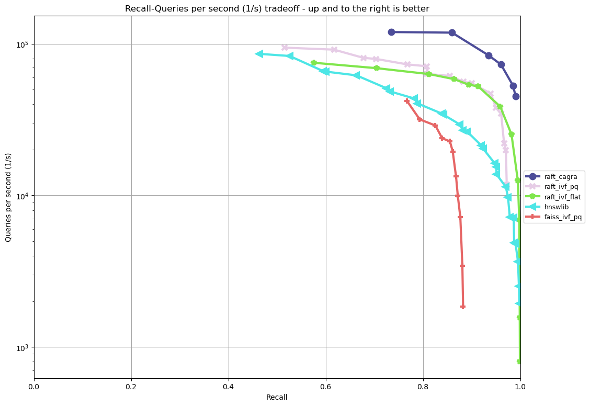

# RAFT ANN Benchmarks

This project provides a benchmark program for various ANN search implementations. It's especially suitable for comparing GPU implementations as well as comparing GPU against CPU.

## Table of Contents

- [Installing and Running the Benchmarks](#installing--and-running-the-benchmarks)
    - [Using conda](#conda)
    - [Using Docker](#docker)
- [End-to-end example: Million-scale](end-to-end-example-million-scale)
- [End-to-end example: Billion-scale](#end-to-end-example-billion-scale)
- [Creating and customizing dataset configurations](#creating-and-customizing-dataset-configurations)
- [Adding a new ANN algorithm](#adding-a-new-ann-algorithm)

## Installing and Running the Benchmarks

There are two main ways pre-compiled benchmarks are distributed:

- [Conda](#Conda): Great solution for users not using containers but want an easy to install and use Python package. Pip wheels are planned to be added as an alternative for users that cannot use conda and prefer to not use containers.
- [Docker](#Docker): Great solution that only needs docker and NVIDIA docker to use. Provides a single docker run command for basic dataset benchmarking, as well as all the functionality of the conda solution inside the containers.

## Conda

If containers are not an option or not preferred, the easiest way to install the ANN benchmarks is through conda. We provide packages for GPU enabled systems, as well for systems without a GPU. We suggest using mamba as it generally leads to a faster install time:

```bash

mamba create --name raft_ann_benchmarks
conda activate raft_ann_benchmarks

# to install GPU package:
mamba install -c rapidsai -c conda-forge -c nvidia raft-ann-bench cuda-version=11.8*

# to install CPU package for usage in CPU-only systems:
mamba install -c rapidsai -c conda-forge  raft-ann-bench-cpu
```

The channel `rapidsai` can easily be substituted `rapidsai-nightly` if nightly benchmarks are desired. The CPU package currently allows to run the HNSW benchmarks.

Please see the [build instructions](ann_benchmarks_build.md) to build the benchmarks from source.

## Running the benchmarks

### Python Package Usage
There are 4 general steps to running the benchmarks and visualizing the results:
1. Prepare Dataset
2. Build Index and Search Index
3. Data Export
4. Plot Results

We provide a collection of lightweight Python scripts that are wrappers over
lower level scripts and executables to run our benchmarks. Either Python scripts or
[low-level scripts and executables](ann_benchmarks_low_level.md) are valid methods to run benchmarks,
however plots are only provided through our Python scripts.

### End-to-end example: Million-scale

The steps below demonstrate how to download, install, and run benchmarks on a subset of 10M vectors from the Yandex Deep-1B dataset By default the datasets will be stored and used from the folder indicated by the `RAPIDS_DATASET_ROOT_DIR` environment variable if defined, otherwise a datasets sub-folder from where the script is being called:

```bash

# (1) prepare dataset.
python -m raft-ann-bench.get_dataset --dataset deep-image-96-angular --normalize

# (2) build and search index
python -m raft-ann-bench.run --dataset deep-image-96-inner

# (3) export data
python -m raft-ann-bench.data_export --dataset deep-image-96-inner

# (4) plot results
python -m raft-ann-bench.plot --dataset deep-image-96-inner
```

Configuration files already exist for the following list of the million-scale datasets. Please refer to [ann-benchmarks datasets](https://github.com/erikbern/ann-benchmarks/#data-sets) for more information, including actual train and sizes. These all work out-of-the-box with the `--dataset` argument. Other million-scale datasets from `ann-benchmarks.com` will work, but will require a json configuration file to be created in `$CONDA_PREFIX/lib/python3.xx/site-packages/raft-ann-bench/run/conf`, or you can specify the `--configuration` option to use a specific file.
- `deep-image-96-angular`
- `fashion-mnist-784-euclidean`
- `glove-50-angular`
- `glove-100-angular`
- `mnist-784-euclidean`
- `nytimes-256-angular`
- `sift-128-euclidean`

## Docker

We provide images for GPU enabled systems, as well as systems without a GPU. The following images are available:

- `raft-ann-bench`: Contains GPU and CPU benchmarks, can run all algorithms supported. Will download million-scale datasets as required. Best suited for users that prefer a smaller container size for GPU based systems. Requires the NVIDIA Container Toolkit to run GPU algorithms, can run CPU algorithms without it.
- `raft-ann-bench-datasets`: Contains the GPU and CPU benchmarks with million-scale datasets already included in the container. Best suited for users that want to run multiple million scale datasets already included in the image.
- `raft-ann-bench-cpu`: Contains only CPU benchmarks with minimal size. Best suited for users that want the smallest containers to reproduce benchmarks on systems without a GPU.

Nightly images are located in [dockerhub](https://hub.docker.com/r/rapidsai/raft-ann-bench), meanwhile release (stable) versions are located in [NGC](https://hub.docker.com/r/rapidsai/raft-ann-bench), starting with release 23.10.

- The following command pulls the nightly container for python version 10, cuda version 12, and RAFT version 23.10:

```bash
docker pull rapidsai/raft-ann-bench:23.10a-cuda12.0-py3.10 #substitute raft-ann-bench for the exact desired container.
```

The CUDA and python versions can be changed for the supported values:

Supported CUDA versions: 11.2 and 12.0
Supported Python versions: 3.9 and 3.10.

You can see the exact versions as well in the dockerhub site:

- [RAFT ANN Benchmark images](https://hub.docker.com/r/rapidsai/raft-ann-bench/tags)
- [RAFT ANN Benchmark with datasets preloaded images](https://hub.docker.com/r/rapidsai/raft-ann-bench-cpu/tags)
- [RAFT ANN Benchmark CPU only images](https://hub.docker.com/r/rapidsai/raft-ann-bench-datasets/tags)

**Note:** GPU containers use the CUDA toolkit from inside the container, the only requirement is a driver installed on the host machine that supports that version. So, for example, CUDA 11.8 containers can run in systems with a CUDA 12.x capable driver.

-  The following command (only available after RAPIDS 23.10 release) pulls the container:

```bash
docker pull nvcr.io/nvidia/rapidsai/raft-ann-bench:23.08-cuda11.8-py3.10 #substitute raft-ann-bench for the exact desired container.
```

### Container Usage

The container can be used in two different ways:

1. **Automated benchmark with single `docker run` (ease mode)**: Helper scripts are included to ease the procedure of running benchmarks end-to-end:

For GPU systems, where `$DATA_FOLDER` is a local folder where you want datasets stored in `$DATA_FOLDER/datasets` and results in `$DATA_FOLDER/result` (we highly recommend `$DATA_FOLDER` to be a dedicated folder for the datasets and results of the containers):

```bash
export DATA_FOLDER=path/to/store/datasets/and/results
docker run --gpus all --rm -it -u $(id -u) \
    -v $DATA_FOLDER:/home/rapids/benchmarks  \
    rapidsai/raft-ann-bench:23.10a-cuda11.8-py3.10 \
    "--dataset deep-image-96-angular" \
    "--normalize" \
    "--algorithms raft_cagra,raft_ivf_pq" \
    ""
```

Where:

```bash
export DATA_FOLDER=path/to/store/datasets/and/results # <- local folder to store datasets and results
docker run --gpus all --rm -it -u $(id -u) \
    -v $DATA_FOLDER:/home/rapids/benchmarks  \
    rapidsai/raft-ann-bench:23.10a-cuda11.8-py3.10 \ # <- image to use, either `raft-ann-bench` or `raft-ann-bench-datasets`, can choose RAPIDS, cuda and python versions.
    "--dataset deep-image-96-angular" \ # <- dataset name
    "--normalize" \ # <- whether to normalize the dataset, leave string empty ("") to not normalize.
    "--algorithms raft_cagra" \ # <- what algorithm(s) to use as a ; separated list, as well as any other argument to pass to `raft_ann_benchmarks.run`
    "" # optional arguments to pass to `raft_ann_benchmarks.plot`
```

*** Note about user and file permissions: *** The flag `-u $(id -u)` allows the user inside the container to match the `uid` of the user outside the container, allowing the container to read and write to the mounted volume indicated by $DATA_FOLDER.

For CPU systems the same interface applies, except for not needing the gpus argument and using the cpu images:
```bash
export DATA_FOLDER=path/to/store/datasets/and/results
docker run  all --rm -it -u $(id -u) \
    -v $DATA_FOLDER:/home/rapids/benchmarks  \
    rapidsai/raft-ann-bench-cpu:23.10a-py3.10 \
     "--dataset deep-image-96-angular" \
     "--normalize" \
     "--algorithms raft_cagra" \
     ""
```

**Note:** The user inside the containers is `root`. To workaround this, the scripts in the containers fix the user of the output files after the benchmarks are run. If the benchmarks are interrupted, the owner of the `datasets/results` produced by the container will be wrong, and will need to be manually fixed by the user.

2. **Using the preinstalled `raft_ann_benchmarks` python package (advanced mode)**: The docker containers are built using the conda packages described in the following section, so they can be used directly as if they were installed manually following the instructions in the next section. This is recommended for advanced users, and is the option that allows the full flexibility of the benchmarking scripts. To use the python scripts directly, use the following command:

```bash
export DATA_FOLDER=path/to/store/datasets/and/results
docker run --gpus all --rm -it -u $(id -u) \
    -v $DATA_FOLDER:/home/rapids/benchmarks  \
    rapidsai/raft-ann-bench:23.10a-cuda11.8-py3.10 \
    --entrypoint /bin/bash
```

This will drop you into a command line in the container, with the `raft_ann_benchmarks` python package ready to use, as was described in the prior [conda section](#conda):

```
(base) root@00b068fbb862:/home/rapids#
```

Additionally, the containers could be run in dettached mode without any issue.

## End-to-end example: Billion-scale
`raft-ann-bench.get_dataset` cannot be used to download the [billion-scale datasets](ann_benchmarks_dataset.md#billion-scale)
because they are so large. You should instead use our billion-scale datasets guide to download and prepare them.
All other python  mentioned below work as intended once the
billion-scale dataset has been downloaded.
To download Billion-scale datasets, visit [big-ann-benchmarks](http://big-ann-benchmarks.com/neurips21.html)

The steps below demonstrate how to download, install, and run benchmarks on a subset of 100M vectors from the Yandex Deep-1B dataset. Please note that datasets of this scale are recommended for GPUs with larger amounts of memory, such as the A100 or H100. 
```bash

mkdir -p datasets/deep-1B
# (1) prepare dataset
# download manually "Ground Truth" file of "Yandex DEEP"
# suppose the file name is deep_new_groundtruth.public.10K.bin
python -m raft-ann-bench.split_groundtruth --groundtruth datasets/deep-1B/deep_new_groundtruth.public.10K.bin
# two files 'groundtruth.neighbors.ibin' and 'groundtruth.distances.fbin' should be produced

# (2) build and search index
python -m raft-ann-bench.run --dataset deep-1B

# (3) export data
python -m raft-ann-bench.data_export --dataset deep-1B

# (4) plot results
python -m raft-ann-bench.plot --dataset deep-1B
```

The usage of `python -m raft-ann-bench.split_groundtruth` is:
```bash
usage: split_groundtruth.py [-h] --groundtruth GROUNDTRUTH

options:
  -h, --help            show this help message and exit
  --groundtruth GROUNDTRUTH
                        Path to billion-scale dataset groundtruth file (default: None)
```

#### Step 1: Prepare Dataset<a id='prep-dataset'></a>
The script `raft-ann-bench.get_dataset` will download and unpack the dataset in directory
that the user provides. As of now, only million-scale datasets are supported by this
script. For more information on [datasets and formats](ann_benchmarks_dataset.md).

The usage of this script is:
```bash
usage: get_dataset.py [-h] [--name NAME] [--dataset-path DATASET_PATH] [--normalize]

options:
  -h, --help            show this help message and exit
  --dataset DATASET     dataset to download (default: glove-100-angular)
  --dataset-path DATASET_PATH
                        path to download dataset (default: ${RAPIDS_DATASET_ROOT_DIR})
  --normalize           normalize cosine distance to inner product (default: False)
```

When option `normalize` is provided to the script, any dataset that has cosine distances
will be normalized to inner product. So, for example, the dataset `glove-100-angular` 
will be written at location `datasets/glove-100-inner/`.

### Step 2: Build and Search Index
The script `raft-ann-bench.run` will build and search indices for a given dataset and its
specified configuration.
To confirgure which algorithms are available, we use `algos.yaml`.
To configure building/searching indices for a dataset, look at [index configuration](#json-index-config).
An entry in `algos.yaml` looks like:
```yaml
raft_ivf_pq:
  executable: RAFT_IVF_PQ_ANN_BENCH
  requires_gpu: true
```
`executable` : specifies the name of the binary that will build/search the index. It is assumed to be
available in `raft/cpp/build/`.
`requires_gpu` : denotes whether an algorithm requires GPU to run.

The usage of the script `raft-ann-bench.run` is:
```bash
usage: run.py [-h] [-k COUNT] [-bs BATCH_SIZE] [--configuration CONFIGURATION] [--dataset DATASET] [--dataset-path DATASET_PATH] [--build] [--search] [--algorithms ALGORITHMS] [--indices INDICES]
              [-f]

options:
  -h, --help            show this help message and exit
  -k COUNT, --count COUNT
                        the number of nearest neighbors to search for (default: 10)
  -bs BATCH_SIZE, --batch-size BATCH_SIZE
                        number of query vectors to use in each query trial (default: 10000)
  --configuration CONFIGURATION
                        path to configuration file for a dataset (default: None)
  --dataset DATASET     dataset whose configuration file will be used (default: glove-100-inner)
  --dataset-path DATASET_PATH
                        path to dataset folder (default: ${RAPIDS_DATASET_ROOT_DIR})
  --build
  --search
  --algorithms ALGORITHMS
                        run only comma separated list of named algorithms (default: None)
  --indices INDICES     run only comma separated list of named indices. parameter `algorithms` is ignored (default: None)
  -f, --force           re-run algorithms even if their results already exist (default: False)
```

`configuration` and `dataset` : `configuration` is a path to a configuration file for a given dataset.
The configuration file should be name as `<dataset>.json`. It is optional if the name of the dataset is
provided with the `dataset` argument, in which case
a configuration file will be searched for as `python/raft-ann-bench/src/raft-ann-bench/run/conf/<dataset>.json`.
For every algorithm run by this script, it outputs an index build statistics JSON file in `<dataset-path/<dataset>/result/build/<algo-k{k}-batch_size{batch_size}.json>`
and an index search statistics JSON file in `<dataset-path/<dataset>/result/search/<algo-k{k}-batch_size{batch_size}.json>`.

`dataset-path` : 
1. data is read from `<dataset-path>/<dataset>`
2. indices are built in `<dataset-path>/<dataset>/index`
3. build/search results are stored in `<dataset-path>/<dataset>/result`

`build` and `search` : if both parameters are not supplied to the script then
it is assumed both are `True`.

`indices` and `algorithms` : these parameters ensure that the algorithm specified for an index 
is available in `algos.yaml` and not disabled, as well as having an associated executable.

### Step 3: Data Export
The script `raft-ann-bench.data_export` will convert the intermediate JSON outputs produced by `raft-ann-bench.run` to more
easily readable CSV files, which are needed to build charts made by `raft-ann-bench.plot`.

```bash
usage: data_export.py [-h] [--dataset DATASET] [--dataset-path DATASET_PATH]

options:
  -h, --help            show this help message and exit
  --dataset DATASET     dataset to download (default: glove-100-inner)
  --dataset-path DATASET_PATH
                        path to dataset folder (default: ${RAPIDS_DATASET_ROOT_DIR})
```
Build statistics CSV file is stored in `<dataset-path/<dataset>/result/build/<algo-k{k}-batch_size{batch_size}.csv>`
and index search statistics CSV file in `<dataset-path/<dataset>/result/search/<algo-k{k}-batch_size{batch_size}.csv>`.

#### Step 4: Plot Results
The script `raft-ann-bench.plot` will plot results for all algorithms found in index search statistics
CSV file in `<dataset-path/<dataset>/result/search/<-k{k}-batch_size{batch_size}>.csv`.

The usage of this script is:
```bash
usage: plot.py [-h] [--dataset DATASET] [--dataset-path DATASET_PATH] [--output-filepath OUTPUT_FILEPATH] [--algorithms ALGORITHMS] [-k COUNT] [-bs BATCH_SIZE] [--build] [--search]
               [--x-scale X_SCALE] [--y-scale {linear,log,symlog,logit}] [--raw]

options:
  -h, --help            show this help message and exit
  --dataset DATASET     dataset to download (default: glove-100-inner)
  --dataset-path DATASET_PATH
                        path to dataset folder (default: ${RAPIDS_DATASET_ROOT_DIR})
  --output-filepath OUTPUT_FILEPATH
                        directory for PNG to be saved (default: os.getcwd())
  --algorithms ALGORITHMS
                        plot only comma separated list of named algorithms (default: None)
  -k COUNT, --count COUNT
                        the number of nearest neighbors to search for (default: 10)
  -bs BATCH_SIZE, --batch-size BATCH_SIZE
                        number of query vectors to use in each query trial (default: 10000)
  --build
  --search
  --x-scale X_SCALE     Scale to use when drawing the X-axis. Typically linear, logit or a2 (default: linear)
  --y-scale {linear,log,symlog,logit}
                        Scale to use when drawing the Y-axis (default: linear)
  --raw                 Show raw results (not just Pareto frontier) in faded colours (default: False)
```

The figure below is the resulting plot of running our benchmarks as of August 2023 for a batch size of 10, on an NVIDIA H100 GPU and an Intel Xeon Platinum 8480CL CPU. It presents the throughput (in Queries-Per-Second) performance for every level of recall.



## Creating and customizing dataset configurations

A single configuration file will often define a set of algorithms, with associated index and search parameters, for a specific dataset. A configuration file uses json format with 4 major parts:
1. Dataset information
2. Algorithm information
3. Index parameters
4. Search parameters

Below is a simple example configuration file for the 1M-scale `sift-128-euclidean` dataset:

```json
{
  "dataset": {
    "name": "sift-128-euclidean",
    "base_file": "sift-128-euclidean/base.fbin",
    "query_file": "sift-128-euclidean/query.fbin", 
    "subset_size": 1000000,
    "groundtruth_neighbors_file": "sift-128-euclidean/groundtruth.neighbors.ibin",
    "distance": "euclidean"
  },
  "index": []
}
```

The `index` section will contain a list of index objects, each of which will have the following form:
```json
{
   "name": "algo_name.unique_index_name",
   "algo": "algo_name",
   "file": "sift-128-euclidean/algo_name/param1_val1-param2_val2",
   "build_param": { "param1": "val1", "param2": "val2" },
   "search_params": [{ "search_param1": "search_val1" }]
}
```

The table below contains the possible settings for the `algo` field. Each unique algorithm will have its own set of `build_param` and `search_params` settings. The [ANN Algorithm Parameter Tuning Guide](ann_benchmarks_param_tuning.md) contains detailed instructions on choosing build and search parameters for each supported algorithm.

| Library   | Algorithms                                                      |
|-----------|-----------------------------------------------------------------|
| FAISS GPU | `faiss_flat`, `faiss_gpu_ivf_flat`, `faiss_gpu_ivf_pq`          |
| FAISS CPU | `faiss_flat`, `faiss_ivf_flat`, `faiss_ivf_pq`                  |
| GGNN      | `ggnn`                                                          |
| HNSWlib   | `hnswlib`                                                       |
| RAFT      | `raft_brute_force`, `raft_cagra`, `raft_ivf_flat`, `raft_ivf_pq` |


By default, the index will be placed in `bench/ann/data/<dataset_name>/index/<name>`. Using `sift-128-euclidean` for the dataset with the `algo` example above, the indexes would be placed in `bench/ann/data/sift-128-euclidean/index/algo_name/param1_val1-param2_val2`.


## Adding a new ANN algorithm

### Implementation and Configuration
Implementation of a new algorithm should be a C++ class that inherits `class ANN` (defined in `cpp/bench/ann/src/ann.h`) and implements all the pure virtual functions.

In addition, it should define two `struct`s for building and searching parameters. The searching parameter class should inherit `struct ANN<T>::AnnSearchParam`. Take `class HnswLib` as an example, its definition is:
```c++
template<typename T>
class HnswLib : public ANN<T> {
public:
  struct BuildParam {
    int M;
    int ef_construction;
    int num_threads;
  };

  using typename ANN<T>::AnnSearchParam;
  struct SearchParam : public AnnSearchParam {
    int ef;
    int num_threads;
  };

  // ...
};
```

<a id='json-index-config'></a>The benchmark program uses JSON format in a configuration file to specify indexes to build, along with the build and search parameters. To add the new algorithm to the benchmark, need be able to specify `build_param`, whose value is a JSON object, and `search_params`, whose value is an array of JSON objects, for this algorithm in configuration file. The `build_param` and `search_param` arguments will vary depending on the algorithm.  Take the configuration for `HnswLib` as an example:
```json
{
  "name" : "hnswlib.M12.ef500.th32",
  "algo" : "hnswlib",
  "build_param": {"M":12, "efConstruction":500, "numThreads":32},
  "file" : "/path/to/file",
  "search_params" : [
    {"ef":10, "numThreads":1},
    {"ef":20, "numThreads":1},
    {"ef":40, "numThreads":1},
  ],
  "search_result_file" : "/path/to/file"
},
```
How to interpret these JSON objects is totally left to the implementation and should be specified in `cpp/bench/ann/src/factory.cuh`:
1. First, add two functions for parsing JSON object to `struct BuildParam` and `struct SearchParam`, respectively:
    ```c++
    template<typename T>
    void parse_build_param(const nlohmann::json& conf,
                           typename cuann::HnswLib<T>::BuildParam& param) {
      param.ef_construction = conf.at("efConstruction");
      param.M = conf.at("M");
      if (conf.contains("numThreads")) {
        param.num_threads = conf.at("numThreads");
      }
    }

    template<typename T>
    void parse_search_param(const nlohmann::json& conf,
                            typename cuann::HnswLib<T>::SearchParam& param) {
      param.ef = conf.at("ef");
      if (conf.contains("numThreads")) {
        param.num_threads = conf.at("numThreads");
      }
    }
    ```

2. Next, add corresponding `if` case to functions `create_algo()` (in `cpp/bench/ann/) and `create_search_param()` by calling parsing functions. The string literal in `if` condition statement must be the same as the value of `algo` in configuration file. For example,
    ```c++
      // JSON configuration file contains a line like:  "algo" : "hnswlib"
      if (algo == "hnswlib") {
         // ...
      }
    ```

### Adding a CMake Target
In `raft/cpp/bench/ann/CMakeLists.txt`, we provide a `CMake` function to configure a new Benchmark target with the following signature:
```
ConfigureAnnBench(
  NAME <algo_name> 
  PATH </path/to/algo/benchmark/source/file> 
  INCLUDES <additional_include_directories> 
  CXXFLAGS <additional_cxx_flags>
  LINKS <additional_link_library_targets>
)
```

To add a target for `HNSWLIB`, we would call the function as:
```
ConfigureAnnBench(
  NAME HNSWLIB PATH bench/ann/src/hnswlib/hnswlib_benchmark.cpp INCLUDES
  ${CMAKE_CURRENT_BINARY_DIR}/_deps/hnswlib-src/hnswlib CXXFLAGS "${HNSW_CXX_FLAGS}"
)
```

This will create an executable called `HNSWLIB_ANN_BENCH`, which can then be used to run `HNSWLIB` benchmarks.
